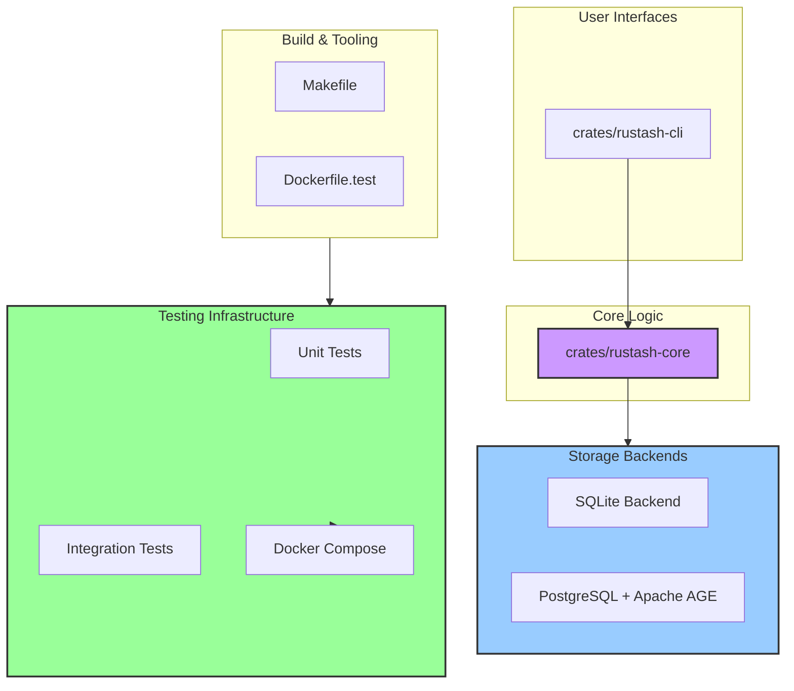

# Rustash Architecture Guide

Welcome, architect! This document serves as the blueprint for the Rustash project. It outlines the high-level architecture, design principles, component responsibilities, and the strategic roadmap for its evolution.

## 1. Project Philosophy & Goals

Rustash is a powerful, flexible snippet manager that combines modern Rust practices with an innovative AI-driven development workflow.

*   **Multi-Backend Support**: Built with flexibility in mind, supporting both SQLite for local development and PostgreSQL with Apache AGE for scalable, graph-enabled deployments.
*   **Containerized Development**: Comprehensive Docker and Docker Compose setup for consistent development and testing environments.
*   **AI-Driven Development**: Leverages a sophisticated system of Product Requirement Prompts (PRPs) to guide AI-assisted development, ensuring consistency, quality, and velocity.
*   **Extensible Core**: The core logic is decoupled from storage backends and user interfaces, allowing for future expansion to different frontends and storage solutions.

## 2. High-Level Architecture

Rustash is structured as a Rust workspace with a clear separation of concerns between components.



### Component Responsibilities

*   **`rustash-core`**: The heart of the application containing all business logic, storage abstractions, and data models. It defines the `StorageBackend` trait that all storage implementations must implement.
*   **`rustash-cli`**: The command-line interface built with `clap` that provides a user-friendly way to interact with the core functionality.
*   **Storage Backends**:
    - **SQLite**: Local, file-based storage using SQLite with FTS5 for full-text search.
    - **PostgreSQL + Apache AGE**: Scalable, graph-enabled storage supporting advanced relationships between snippets.
*   **Testing Infrastructure**:
    - Unit tests co-located with code
    - Integration tests for each backend
    - Containerized test environments using Docker
    - Makefile targets for common test scenarios
*   **`rustash-cli`**: The primary user interface. It's a binary crate that parses command-line arguments (via `clap`), interacts with the user, and calls into `rustash-core` to perform actions.
*   **`rustash-desktop`**: A planned binary crate for a graphical user interface using Tauri. It will reuse `rustash-core` for all its logic.
*   **`macros` & `utils`**: Library crates for shared, reusable code like procedural macros or common utility functions (e.g., configuration management).
*   **`xtask`**: A build-automation crate that provides custom `cargo` commands for linting, testing, and other development tasks.
*   **`PRPs/` & `.claude/`**: The engine of our AI-driven development process, containing structured prompts and configurations for Claude Code.

### Data Flow Example: `rustash add`

1.  **User** runs `rustash add "Title" "Content" --tags rust`.
2.  **`rustash-cli`** (`main.rs`) parses the command using `clap`.
3.  The `AddCommand`'s `execute` method is called.
4.  It creates a `NewSnippet` model from the arguments.
5.  It calls the `add_snippet` function from **`rustash-core`**.
6.  **`rustash-core`** (`snippet.rs`) validates the input.
7.  It uses a `DbConnection` to interact with the database.
8.  A Diesel query inserts the new snippet into the SQLite database.
9.  The newly created `Snippet` (with ID) is returned to the CLI.
10. **`rustash-cli`** formats a success message and prints it to the console.

## 3. Core Components

### rustash-core

The core library containing all the business logic, data models, and database interactions.

#### Key Modules

*   **`models.rs`**: Defines the core data structures (`Snippet`, `DbSnippet`, `NewDbSnippet`, `UpdateSnippet`) with UUID primary keys and their database representations.
*   **`snippet.rs`**: The "service layer" containing all the snippet-related business logic (CRUD, search, placeholder expansion).
*   **`storage.rs`**: Defines the `StorageBackend` trait and implementations for different storage backends.
*   **`memory.rs`**: Defines the `MemoryItem` trait for items that can be stored in memory.
*   **`error.rs`**: A well-defined error enum using `thiserror`, which is a best practice for Rust libraries.
*   **`schema.rs`**: Defines the database schema with UUID primary keys, auto-generated by Diesel.

### Storage Layer

The application supports multiple storage backends through the `StorageBackend` trait, allowing for flexible deployment options:

1. **SQLite Backend**:
   - Local, file-based storage
   - Full-text search using SQLite FTS5
   - Ideal for single-user, local development

2. **PostgreSQL + Apache AGE Backend**:
   - Scalable, multi-user capable
   - Graph database capabilities for snippet relationships
   - Advanced querying with SQL and graph traversals
   - Supports vector similarity search

### Testing Infrastructure

Rustash features a comprehensive testing strategy with containerized environments:

1. **Unit Tests**:
   - Test individual functions and methods
   - No external dependencies
   - Fast execution

2. **Integration Tests**:
   - Test backend implementations
   - Run against real database instances
   - Isolated test environments

3. **Containerized Testing**:
   - Docker Compose for managing test databases
   - Isolated PostgreSQL instances
   - Consistent test environments

#### Running Tests

```bash
# Run SQLite tests (no Docker required)
make test-sqlite

# Run PostgreSQL tests (requires Docker)
make test-postgres

# Run all tests
make test-all

# Run tests in a containerized environment
make test-container
```

### Development Workflow

1. **Local Development**:
   - Uses SQLite by default for fast iteration
   - No external dependencies required

2. **Testing**:
   - Run unit tests with `cargo test`
   - Run integration tests with `make test-all`
   - Use `make test-container` for consistent CI-like testing

3. **CI/CD**:
   - GitHub Actions for automated testing
   - Containerized build and test environments
   - Automated Docker image builds

### Architectural Refinements

*   **Configuration**: Currently, the database URL is sourced from an environment variable or a hardcoded default. This could be improved by introducing a `Config` struct loaded from a file (e.g., `~/.config/rustash/config.toml`), with environment variables as overrides. The unused `crates/utils/src/config.rs` provides a great starting point for this.
*   **Database Abstraction**: The `sqlite` and `postgres` feature flags are a good start. For true backend independence, we could introduce a `DatabaseService` trait in `rustash-core` that defines the contract for all data operations. Then, we could have `SqliteService` and `PostgresService` implementations. This is a future-facing enhancement to consider as the project grows.
*   **Model Logic**: The `Snippet` struct is a plain data object. It could be enhanced with methods. For example, the logic for parsing the JSON `tags` string into a `Vec<String>` could live on the `Snippet` model itself, promoting encapsulation.

## 4. Command-Line Interface (`rustash-cli`)

The CLI is the face of the application. Its design prioritizes user experience and clarity.

*   **`main.rs` & `commands/`**: A clean implementation using `clap`'s derive macro and subcommands, with each command's logic neatly separated into its own module.
*   **`fuzzy.rs`**: Excellent use of `skim` to provide an interactive fuzzy finder, which significantly enhances usability.
*   **`utils.rs`**: Good separation of concerns, with presentation logic like output formatting isolated from command logic.

### Architectural Refinements

*   **Dependency Management**: The CLI's `db.rs` uses a `lazy_static` global for the connection pool. While effective for a simple CLI, a more explicit pattern would be for `main.rs` to initialize the pool and pass it down to the command handlers. This improves testability and makes the data flow more transparent. For the current scale, the existing approach is acceptable, but this is a key point for future refactoring.
*   **Output Formatting**: The logic for different output formats (`table`, `json`, etc.) has been refactored into the `utils::format_snippet_list` function. This simplifies the command handlers and centralizes all presentation logic.

## 5. Developer Experience (DevX) & Automation

The project's investment in DevX is a significant strength.

*   **AI-Driven Workflow**: The PRP system is a sophisticated and powerful way to ensure high-quality, consistent contributions. It's a defining feature of this project.
*   **`xtask` Build System**: Using `cargo xtask` for build automation is a modern Rust best practice. It keeps all build logic in Rust and is more flexible than shell scripts.
*   **Documentation**: The project has a good set of documentation. To make it even better, we should create a central **`DEVELOPER_GUIDE.md`** that serves as an entry point for new contributors, linking to this `ARCHITECTURE.md`, `CONTRIBUTING_WITH_AI.md`, and other relevant resources.

## 6. Architectural Roadmap

Here is a proposed, prioritized list of architectural improvements to guide future development:

*   [ ] **Phase 1: Documentation & Clarity**
    *   [x] Establish this `ARCHITECTURE.md` as the source of truth for design decisions.
    *   [x] Clean up `USER_GUIDE.md` to be a focused, user-facing document.
    *   [x] Improve the `README.md` to be more welcoming and informative for new users and contributors.
    *   [ ] Add comprehensive doc comments to all public APIs in `rustash-core`.

*   [ ] **Phase 2: Code Quality & Maintainability**
    *   [ ] Refactor CLI command handlers to improve testability (e.g., by injecting dependencies).
    *   [ ] Add integration tests for the core library.
    *   [ ] Set up continuous integration (CI) to run tests and checks on every push.

*   [ ] **Phase 3: Enhanced Features**
    *   [ ] Implement a proper configuration system (file-based + env vars).
    *   [ ] Add support for snippet versioning and history.
    *   [ ] Implement a plugin system for extending functionality.

*   [ ] **Phase 4: Future Expansion**
    *   [ ] Design and implement the `DatabaseService` trait for backend independence.
    *   [ ] Begin work on the Tauri desktop application.
    *   [ ] Explore a potential web interface or API server.

## 7. Conclusion

Rustash is built on a solid foundation with a clear separation of concerns between its core logic and user interfaces. The architecture is designed to be both practical for the current feature set and extensible for future growth. By following the roadmap and continuing to invest in documentation and developer experience, Rustash has the potential to become an indispensable tool for developers everywhere.

Remember: Great architecture is not about making the right decisions up front, but about making decisions that are easy to change later. This document, like the code it describes, should evolve over time as the project grows and new requirements emerge.
